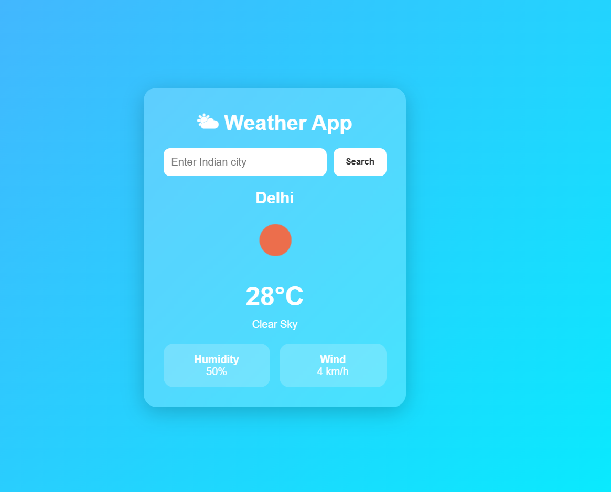

# Weather App

A responsive weather app built using HTML, CSS, and JavaScript.

## Features
- Search Indian cities
- Real-time weather
- Responsive UI
- DOM manipulation

## Technologies
- HTML
- CSS
- JavaScript
- OpenWeatherMap API

## How to Run
1. Download zip file.
2. Extract the zip file.
3. Run it on VS code. 
4. Open index.html in browser.

## Link: https://weather-app-project-new.vercel.app/

## Screenshot

